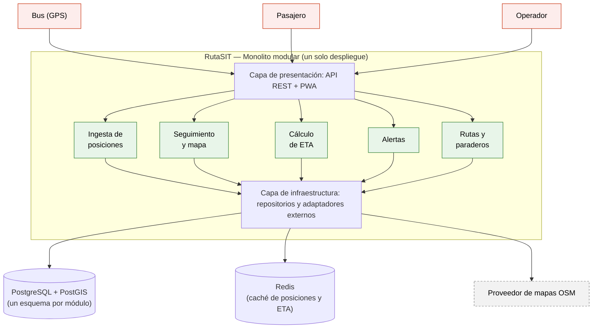

# RutaSIT Arequipa — Laboratorio 04: Fundamentos de arquitectura de software

Construcción de Software · EPIS-UNSA · 2026-B · **Grupo 06**

## Integrantes

| Nombre | Rol en el laboratorio |
|--------|-----------------------|
| Estefanero Palma Rodrigo | Arquitecto/analista: drivers, matriz de decisión, ADR-001 |
| Sullca Mamani Mauro Snayder | Diagramador: Mermaid, PlantUML, vista de despliegue |
| Riveros Vilca Alberth Edwar | Verificador de IA y documentación: bitácora, ADR-002/003, README |

## Caso

RutaSIT Arequipa permite a los pasajeros ver en un mapa la ubicación de los buses del
Sistema Integrado de Transporte y el tiempo estimado de llegada a su paradero, y avisa
al operador de desvíos o congestión. 300 buses envían su posición cada 10 s. El atributo
de calidad crítico es el rendimiento en tiempo real: el ETA debe estar disponible en
≤ 15 s (p95). El MVP debe estar en producción en 1 mes con 3 developers y un solo VPS.

## Arquitectura elegida

Monolito modular en Django, con PostgreSQL + PostGIS como almacenamiento y Redis como
caché de posiciones y ETA. Un solo despliegue, cinco módulos (Ingesta, Seguimiento, ETA,
Alertas, Rutas) que se comunican únicamente por interfaces públicas.

Fuente del diagrama: [`docs/architecture/diagramas/arquitectura.mmd`](docs/architecture/diagramas/arquitectura.mmd)

Trazabilidad con los drivers: M1 = RF-01, M2 = RF-02 y RF-06, M3 = RF-03, M4 = RF-04,
M5 = RF-05.

## Decisiones arquitectónicas

| ADR | Decisión | Autor |
|-----|----------|-------|
| [ADR-001](docs/architecture/adr/001-estilo-arquitectonico.md) | Estilo arquitectónico: monolito modular | Rol A |
| [ADR-002](docs/architecture/adr/002-protocolo-ingesta-gps.md) | Protocolo de ingesta GPS: HTTPS POST en lugar de MQTT | Rol C |
| [ADR-003](docs/architecture/adr/003-actualizacion-tiempo-real.md) | Actualización en tiempo real: polling 10 s sobre Redis | Rol C |

## Documentación de arquitectura

- [Drivers y escenarios de calidad](docs/architecture/drivers.md) — RF, atributos de calidad, restricciones y escenarios QA
- [Matriz de decisión](docs/architecture/matriz-decision.md) — alternativas, pesos y cálculo ponderado
- [Bitácora de uso de IA](docs/architecture/bitacora-ia.md) — 5 interacciones reales con Claude, DeepSeek, ChatGPT y Gemini

## Reflexión sobre el uso de la IA

La IA nos aceleró el arranque, pero no reemplazó la decisión arquitectónica. El caso más
claro fue la recomendación de Claude en el prompt 1: propuso un monolito modular orientado
a eventos con Redis y WebSocket/SSE, y la justificaba con que un canal persistente ahorraba
datos al pasajero. Ninguna de las dos cosas se apoyaba en algo medido, y la primera chocaba
con R-02 y ponía en riesgo R-01. Cuando le pedimos la crítica adversarial en el prompt 2,
la misma herramienta se contradijo y retiró su recomendación. Ahí entendimos que aceptar
la primera respuesta de una IA sin contrastarla con los drivers del proyecto es el error
más probable, y que hay que leer siempre la crítica además de la propuesta. DeepSeek
tTambién falló: su diagrama Mermaid renderizaba bien pero dibujaba dependencias directas
entre módulos, rompiendo el aislamiento que acordamos en ADR-001. Y en el prompt 5, Gemini
afirmó datos muy concretos sobre el SIT de Arequipa (fechas, nombres de apps, ausencia de
GTFS) sin citar ninguna fuente verificable, por lo que decidimos no depender de ninguna API
externa. En resumen, nos sirvió como generador de alternativas y de estructura, pero cada
recomendación tuvo que filtrarse contra nuestras restricciones, y los tres casos de
desviación fueron distintos: sobrearquitectura, diagramas que rompen una decisión ya tomada,
y datos inventados con apariencia de certeza.
